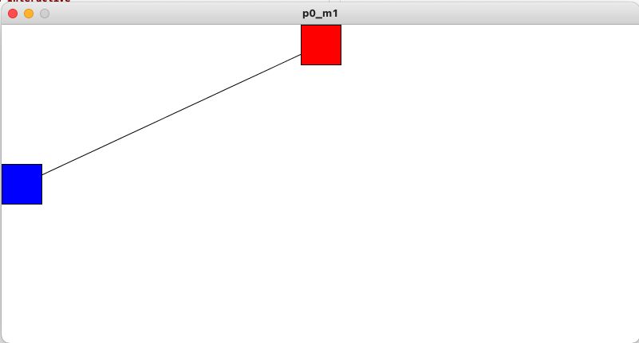
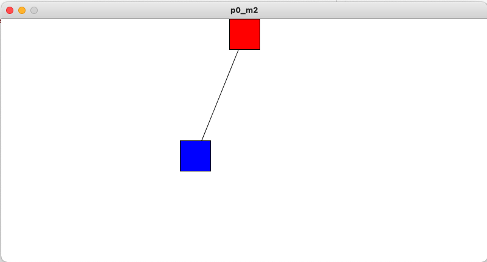
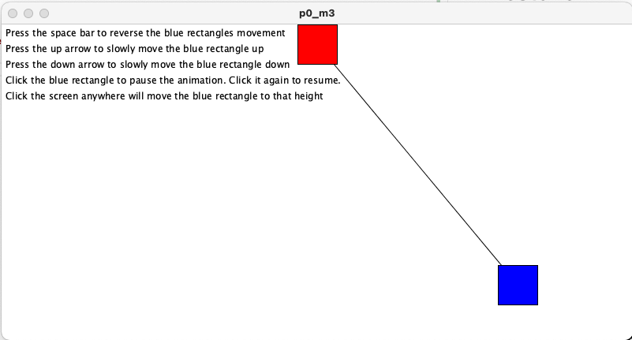
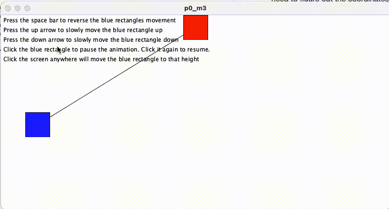

# Project 0
In this project we want to slowy build our drawing, animating and interactive skills for the processing framework.

# Resources

Processing: https://processing.org/

Processing Reference: https://processing.org/reference/

Processing Drawing: https://processing.org/tutorials/drawing/

## Milestone 1 : Just Draw

First we need to draw a red rectangle at the top center of the screen. Be sure to make it dead center. Secondly we will draw a blue recttangle on the left hand side in the exact center of the height. Lastly, lets draw a line connecting the center of the red rectangle to the center of the blue rectangle.

HINT: The coordinate system for pixels in a computer window, however, is reversed along the y-axis. (0,0) can be found at the top left with the positive direction to the right horizontally and down vertically. - (https://processing.org/tutorials/drawing/)

## Milestone 2 : Animate it!

Ok, now that we have some objects on the canvas, let's make it do something. 

    void draw() {

    }

One thing to note is that the draw function that Proccessing uses that draw function as a way to render a frame in an animation. Each loop in the animation is a result of a successful call to draw(). The draw() function if called repedatvly untill the application stops or you tell it to stop. In a way you can look at draw() like a loop, and anything you put in the loop will be iterated over and over. 

Things to think about:
- How can you make the blue rectangle go back and forth on the screen?
- How can you make sure that the blue rectangle does not go off the screen when it reaches the right side?
- How can you make it go back to the left side once it reaches the right side and bounce back and forth from then on out?

## Milestone 3 : Let's be Interactive

Proccessing is not like using the DOM in javascript. It is a bit more verbose and asks that you understand the coordinate sytem as well as the animation cycle.

- Make the space bar reverse the direction of the blue rectangle
- Make the up arrow move the blue rectangle up a few pixels each time it is pressed.
Make the down arrow move the blue rectangle down a few pixels each time it is pressed.
- Clicking the blue rectangle will pause the animation. Clicking it again will resume the animation. HINT: Proccessing is canvas based so there is no way to just have a button be clickable. You need to figure out the coordinates of the rectangle and detect whether the mouse clicked inside of the rectangle. 
- clicking the screen anywhere should move the blue rectangle to that height and continue moving.

 

## Final project

 